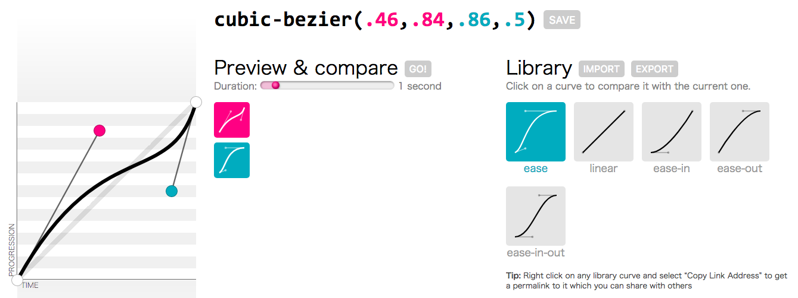

# Transition

`transiton`顾名思义就是`过渡`，让一个物体从一个状态顺滑的过渡到另一个状态。我们可以对过渡的过程进行抽象，可以得到如下过渡属性：

## 1、transition属性

- transition-property
- transition-duration
- transition-timing-function
- transition-delay
- transiton

|name|property|duration|timing-function|delay|
|--------|--------|--------|---------------|-----|
|简介     | 过渡属性 | 过渡事件 | 过渡函数 | 效果什么时候开始 |
|默认值   | all | 0s | ease | 0s |
|应用元素|所有元素，::before与::after伪元素| 相同 | 相同 | 相同 |

其中，transiton是对上述四种属性的简写形式，可以将四种属性写到一个属性中：

```
transition: <transition-property> || <transition-duration> || <transition-timing-function> || <transition-delay>
```

**如下示例：**

```CSS
/* 属性分开定义 */
.demo {
    width: 300px;
    height: 300px;
    background-color: red;

    transition-property: width;
    transition-duration: 2s;
    transition-timing-function: ease-in-out;
    transition-delay: 0s;
}

/* 属性简写 */
.demo {
    width: 300px;
    height: 300px;
    background-color: red;

    transition: width 2s ease-in-out 0s;
}
```


## 2、同时过渡多个属性

有时我们想让物体的多个属性同时变化，比如颜色变化的过程中宽度也变化等等，这里就需要使用多个`逗号`语法：

<iframe height='265' scrolling='no' title='transition-multy' src='//codepen.io/Gavin-YYC/embed/eMGWBe/?height=265&theme-id=0&default-tab=css,result&embed-version=2' frameborder='no' allowtransparency='true' allowfullscreen='true' style='width: 100%;'>See the Pen <a href='https://codepen.io/Gavin-YYC/pen/eMGWBe/'>transition-multy</a> by 杨友存 (<a href='https://codepen.io/Gavin-YYC'>@Gavin-YYC</a>) on <a href='https://codepen.io'>CodePen</a>.
</iframe>

#### 1、当多个属性过渡状态一致时，可以共用transition

```css
.demo {
    width: 300px;
    height: 300px;
    background-color: red;
    /* 注意，多个属性逗号分隔 */
    transition: width, backround-color 2s ease 0s;
}
.demo:hover {
    width: 500px;
    background-color: green;
}
```

#### 2、当多个属性的过渡状态不一致，可以分开定义

```css
.demo {
    width: 300px;
    height: 300px;
    background-color: red;
    /* 注意，多个属性定义逗号分隔 */
    transition: width 2s ease 0s,
                backround-color 1s linear 1s;
}
.demo:hover {
    width: 500px;
    background-color: green;
}
```

## 3、正向反向过渡态

过渡分为两个阶段`forward（正向）`与`reverse（反向）`，比如鼠标经过某个元素时，元素宽度发生变化到达另外一个状态，这个过程称为正向过渡，当鼠标从元素离开时，元素宽度逐渐恢复到初始状态，这称为反向，我们可以分别定义这两个阶段的过渡效果。

举个简单的例子，当鼠标经过时，将使用`:hover`时的过渡状态，但鼠标离开时，反向状态，将使用`非:hover`时的状态：

```CSS
.demo {
  width: 100px;
  padding: 10px;
  border-radius: 5px;
  color: #fff;
  text-align: center;
  background-color: #3a7999;
  transition: width 2s;
}
.demo:hover {
  width: 200px;
  transition-duration: 500ms;
  transition-timing-function: ease-in-out;
}
```

<iframe height='265' scrolling='no' title='transition-forward' src='//codepen.io/Gavin-YYC/embed/LdzWKr/?height=265&theme-id=0&default-tab=css,result&embed-version=2' frameborder='no' allowtransparency='true' allowfullscreen='true' style='width: 100%;'>See the Pen <a href='https://codepen.io/Gavin-YYC/pen/LdzWKr/'>transition-forward</a> by 杨友存 (<a href='https://codepen.io/Gavin-YYC'>@Gavin-YYC</a>) on <a href='https://codepen.io'>CodePen</a>.
</iframe>

## 4、获取过渡中间值

`transition`是一个表象效果，其`computed`值会从就值逐渐过渡到新值，如果脚本在过渡中查看属性的Computed值，则会看到动画属性在当前动画中的中间值。Demo如下：

```javascript
// computed值会随着过渡立即变化
var tip = document.querySelector('.tip');
var demo = document.querySelector('.demo');
var style = window.getComputedStyle(demo);
var timer = null;

demo.addEventListener('mouseenter', function () {
  demo.textContent = 'hold me!';
  clearInterval(timer);
  timer = setInterval(function () {
      tip.innerText = style.width;
  }, 100);
});
```

<iframe height='265' scrolling='no' title='pLrXKY' src='//codepen.io/Gavin-YYC/embed/pLrXKY/?height=265&theme-id=0&default-tab=js,result&embed-version=2' frameborder='no' allowtransparency='true' allowfullscreen='true' style='width: 100%;'>See the Pen <a href='https://codepen.io/Gavin-YYC/pen/pLrXKY/'>pLrXKY</a> by 杨友存 (<a href='https://codepen.io/Gavin-YYC'>@Gavin-YYC</a>) on <a href='https://codepen.io'>CodePen</a>.
</iframe>

## 5、过渡完成事件

在业务中经常遇到需要等过渡结束后执行相应的事件的场景，比如：大转盘旋转了指定的度数之后，弹出中奖结果；进度条在到达100%时弹出相应文案等等。这时候可以使用`ontransitionend`事件：

> 因为兼容性原因，大部分情况下都需要同时注册`webkitTransitionEnd`事件。
> 比如：safari3.1-6、ISO3.2-6.1、android2.1-4.3

```javascript
var tip = document.querySelector('.tip');
var demo = document.querySelector('.demo');

var successCallback = function () {
    tip.textContent = '恭喜您中奖了！';
}

demo.addEventListener('transitionend', successCallback);
demo.addEventListener('webkitTransitionEnd', successCallback);
```

<iframe height='265' scrolling='no' title='transition-event' src='//codepen.io/Gavin-YYC/embed/BrdXzM/?height=265&theme-id=0&default-tab=css,result&embed-version=2' frameborder='no' allowtransparency='true' allowfullscreen='true' style='width: 100%;'>See the Pen <a href='https://codepen.io/Gavin-YYC/pen/BrdXzM/'>transition-event</a> by 杨友存 (<a href='https://codepen.io/Gavin-YYC'>@Gavin-YYC</a>) on <a href='https://codepen.io'>CodePen</a>.
</iframe>

----

注意：如果同时过渡多个属性，则transitionend事件边会执行几次，并且在正向、反向结束时都会触发transitionend事件，在实际业务中需要做好次数判断。

可以通过transition事件对象来判断当前完成的是哪个属性：

```javascript
demo.addEventListener('transitionend', function(e) {
    console.log(e.propertyName);
});
```

## 6、可过渡的CSS属性

- Vstart - 开始值
- Vend - 结束值
- Vres - 中间值
- p - 过渡函数的

输出值：`Vres = (1 - p) * Vstart + p * Vend`当Vres具有有效值时，则该CSS样式可过渡。

| 分类 | 属性 | 属性 | 属性 | 属性 |
|-----|-----|------|-----|------|
|颜色|color<br>background-color<br>border-color<br>outline-color<br>||||
|位置|backround-position<br>left<br>right<br>top<br>bottom||||
|长度|max-height<br>min-height<br>max-width<br>min-width<br>height<br>width|border-width<br>margin<br>padding<br>outline-width<br>outline-offset|font-size<br>line-height<br>text-indent<br>vertical-align|border-spacing<br>letter-spacing<br>word-spacing|
|数字|opacity<br>visibility<br>z-index<br>font-weight<br>zoom||||
|组合|text-shadow<br>transform<br>box-shadow<br>clip||||
|其他|gradient|||||

## 7、过渡函数在线生成（贝塞尔曲线）

[cubic-bezier](http://cubic-bezier.com/)是一个在线可视化生成贝塞尔曲线的工具，可以将操作的结果转为CSS代码直接使用。



当你通过该工具拖拽出负值的时候，该工具会有想过提示：

> This curve contains values out of range. But fear not young padawan! Just use cubic-bezier(.46,0,.83,.67) as well for Webkit until the bug [#45761](https://bugs.webkit.org/show_bug.cgi?id=45761) fix propagates to Safari.

- 1、android 2、4不支持自定义的cubic-bezier
- 2、android4.1、4.2不支持cubic-bezier中值超过1或负的表达式。

## 8、兼容性提示

在上述中已经提示到兼容性的问题，这里统一收纳一下：

- transitionend事件需要同时注册wenkittransitionend事件（safari3.1-6、ISO3.2-6.1、android2.1-4.3）
- android 2、4不支持自定义的cubic-bezier
- android4.1、4.2不支持cubic-bezier中值超过1或负的表达式

关于transition兼容性的详细列表，可参考该网站：http://www.quirksmode.org/css/transitions/mobile.html
包括transitionEnd事件在内。

<iframe src="https://caniuse.bitsofco.de/embed/index.html?feat=css-transitions&amp;periods=future_1,current,past_1,past_2&amp;accessible-colours=false" frameborder="0" width="100%" height="423px"></iframe>

## 9、结合transform

transition结合`transform`属性做出更加出色的效果：

```css
.demo {
    position: relative;
    transform-style: preserve-3d;
}
.demo:after {
    transform-origin: left bottom;
    transform: rotateX(90deg);
}
.demo:hover {
    transform-origin: center bottom;
    transform: rotateX(-90deg) translateY(100%);
}
```

<iframe height='265' scrolling='no' title='transition-3d' src='//codepen.io/Gavin-YYC/embed/aYLwbx/?height=265&theme-id=0&default-tab=css,result&embed-version=2' frameborder='no' allowtransparency='true' allowfullscreen='true' style='width: 100%;'>See the Pen <a href='https://codepen.io/Gavin-YYC/pen/aYLwbx/'>transition-3d</a> by 杨友存 (<a href='https://codepen.io/Gavin-YYC'>@Gavin-YYC</a>) on <a href='https://codepen.io'>CodePen</a>.
</iframe>

## 10、相关资源

- [animate.css](https://daneden.github.io/animate.css/)
- [w3-transitions](https://www.w3.org/TR/css-transitions-1/)
- [深入理解CSS过渡transition](http://www.cnblogs.com/xiaohuochai/p/5347930.html)
- [8 SIMPLE CSS HOVER EFFECTS](http://www.developerdrive.com/2015/01/8-simple-css-hover-effects/)
